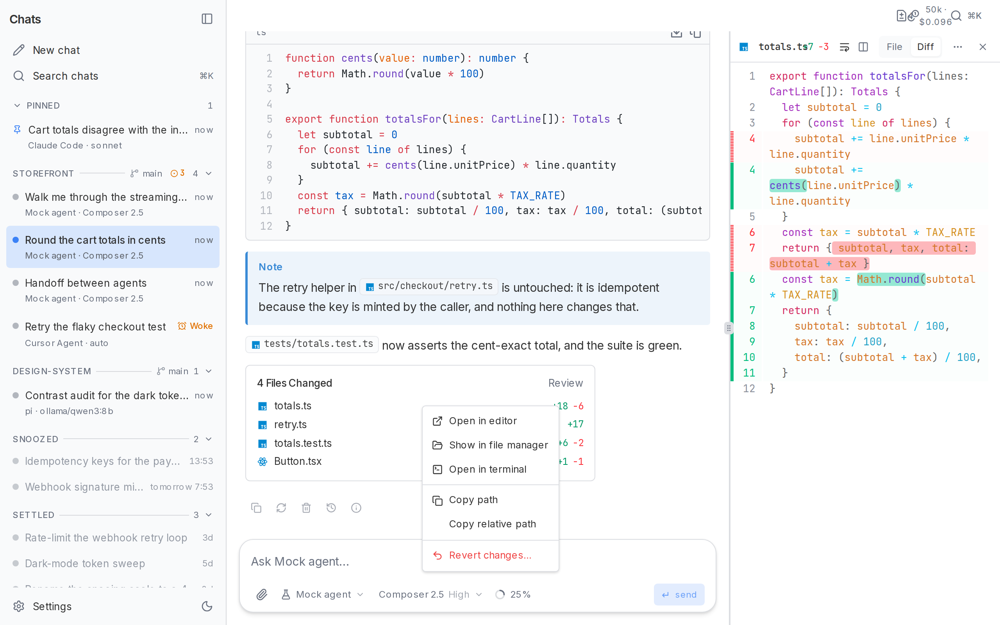
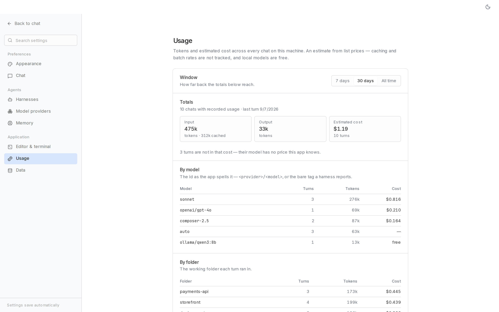

# Agent UI

A local-first desktop and web client for AI coding agents. Agent UI gives
Cursor Agent, Claude Code, pi, Ollama, OpenAI-compatible models, and
[Agent Client Protocol](https://agentclientprotocol.com/) servers one
conversation interface built with Next.js, React, TypeScript, and Tauri.

[](https://github.com/miskibin/agent-ui/actions/workflows/ci.yml)
[](https://github.com/miskibin/agent-ui/actions/workflows/desktop.yml)

[Download for Windows](https://github.com/miskibin/agent-ui/releases/latest) ·
[Chat Components](https://github.com/miskibin/chat-components)


## Why Agent UI

- **One UI, multiple agents.** Switch providers inside a chat. Each backend
  keeps its own resumable session, and an explicit handoff summarizes what it
  missed.
- **Background runs.** A turn keeps streaming when you open another chat.
  Returning shows the same in-flight run and transcript.
- **Agent-native output.** Reasoning, tool lifecycles, structured questions,
  plans, markdown, code, diagrams, artifacts, token usage, and failures are
  first-class parts of the conversation.
- **Workspace-aware files.** Give each chat a folder, inspect changed files and
  diffs beside the transcript, then open them in your editor or terminal.
- **Local persistence.** Chats, settings, provider sessions, and optional memory
  live under `~/.agent-ui`.
- **Visible usage.** See tokens and estimated cost per chat, model, and working
  folder over 7 days, 30 days, or all time.
- **Desktop or browser.** The same Next.js application runs in a frameless
  Tauri shell or as a standalone local server.

## Backends

| Backend | Connection | Tools | Resume |
| --- | --- | :-: | :-: |
| Cursor Agent | local `agent` CLI | Yes | Yes |
| Claude Code | local `claude` CLI | Yes | Yes |
| pi | local `pi` CLI with Ollama or hosted models | Yes | Yes |
| ACP agents | configured command over JSON-RPC; includes a DeepSeek Harness profile | Yes | Yes |
| Ollama | native streaming chat API | No | Transcript replay |
| Chat | any configured OpenAI-compatible `/chat/completions` endpoint | No | Transcript replay |
| Mock | local scripted backend for development and tests | Yes | No |

Provider availability is detected at runtime. Configure binaries, endpoints,
API keys, models, workspaces, and supported permission modes in Settings.

## Quick start

Requires Node.js 20.9 or newer.

```bash
git clone https://github.com/miskibin/agent-ui.git
cd agent-ui
npm install
npm run dev
```

Open [http://localhost:3000](http://localhost:3000). The mock backend works
without another model or CLI, so the complete interface is available
immediately.

For the native app, install the
[Tauri prerequisites](https://v2.tauri.app/start/prerequisites/), then run:

```bash
npm run desktop:dev
npm run desktop:build
```

`desktop:build` creates an installer for the current platform. Signed Windows
installers and update metadata are published on
[GitHub Releases](https://github.com/miskibin/agent-ui/releases).

## Screenshots

| File review | Agent handoff |
| --- | --- |
|  |  |

| Command palette | Usage by model and folder |
| --- | --- |
|  |  |

## Data and permissions

The app stores plain local files in `~/.agent-ui`. Set `AGENT_UI_DIR` to use
another location.

- `settings.json` — appearance, providers, API keys, and chat behavior
- `sessions/index.json` — sidebar and session metadata
- `sessions/<id>.json` — rendered transcripts
- `memory/*.md` — optional cross-chat memory; off by default
- `pi/` and `dsh/` — isolated harness configuration and session data

Treat that directory as sensitive. Agent backends can read files, edit files,
and run commands according to their own capabilities and the permission mode
you select. In particular, pi currently has no sandbox and runs with your OS
user permissions.

## Architecture

```text
React UI ── SSE ──► POST /api/chat ──► AgentProvider.run()
                         │                 ├─ local CLI
                    JSON store             ├─ HTTP model API
                         │                 └─ ACP process
                         ▼
                    ~/.agent-ui
```

Every backend maps to one `AgentStreamEvent` protocol:
`session | status | thinking | tool | text | done | error`. The UI is sourced
from [chat-components](https://github.com/miskibin/chat-components), a
shadcn/ui registry whose files are vendored into this repository.

## Repository map

- `app/` — Next.js pages and API routes
- `app/hooks/use-turn-runner.ts` — concurrent in-flight turns
- `lib/providers/` — backend adapters and provider registry
- `lib/store/` — local session persistence
- `lib/usage.ts` — token and estimated-cost aggregation
- `components/ui/` — vendored chat-components source
- `src-tauri/` — native desktop shell
- `tests/` — provider, persistence, streaming, and UI behavior tests

If you are an AI coding agent, read `AGENTS.md` first. Change shared UI
primitives in chat-components, regenerate its registry, then sync the vendored
files here byte-for-byte.

## Development

```bash
npm run lint
npm run typecheck
npm run test
npm run vendor:check
npm run build
```

## License

MIT
