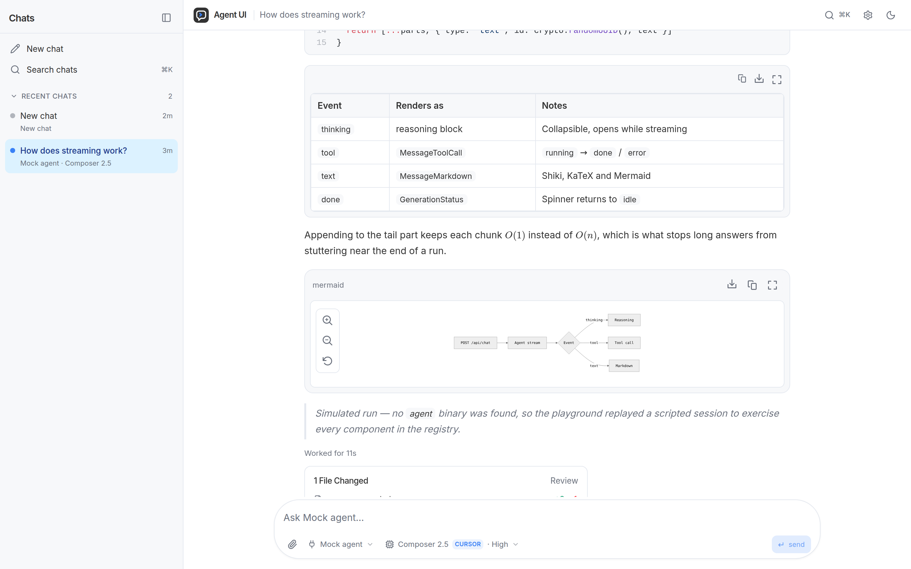
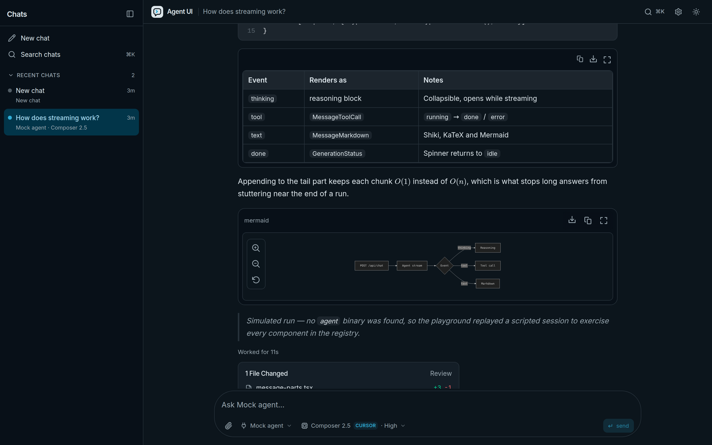
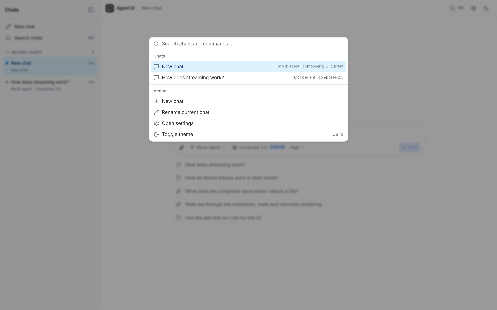
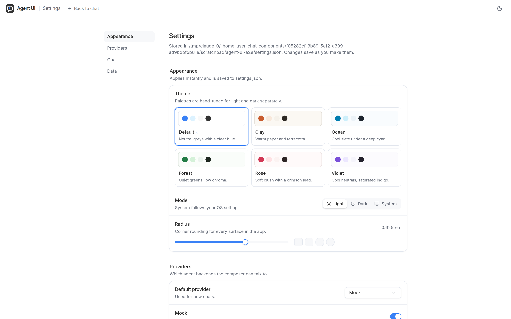

# Agent UI

A fast, local-first **desktop app** for coding agents. One interface, swappable backends: the local `cursor-agent` CLI, any model served by [Ollama](https://ollama.com), or a scripted mock — with Claude Code and OpenCode adapters on the roadmap. Built entirely on [miskibin/chat-components](https://github.com/miskibin/chat-components), the shadcn/ui registry of agent-grade chat primitives, wrapped in a frameless Tauri shell with its own window chrome.

[](https://github.com/miskibin/agent-ui/actions/workflows/ci.yml) [](https://github.com/miskibin/agent-ui/actions/workflows/desktop.yml)



Reasoning streams, tool calls with live status (including failures), Shiki code, tables, KaTeX and Mermaid, a files-changed summary with per-file diff stats — every turn is rendered from the shared `AgentStreamEvent` protocol, whatever backend produced it.

| Dark mode (Ocean theme) | ⌘K command palette |
| --- | --- |
|  |  |



## Providers

| Provider | Tools | Resume | How it connects |
| --- | :-: | :-: | --- |
| **Cursor Agent** | ✅ | ✅ | Spawns the local `agent` CLI; full agentic runs in your workspace |
| **Ollama** | — | replayed | Direct `/api/chat` streaming with `thinking` support (deepseek-r1, qwen3…); stateless, so the app replays the stored transcript |
| **Mock** | ✅ | — | Scripted runs that exercise every UI part; no binary, no network |

Providers are detected at runtime and surfaced in the picker with availability badges. The `AgentProvider` interface (`lib/providers/types.ts`) is ~30 lines — a new backend is one file plus a registry entry.

## Quick start

```bash
npm install
npm run dev        # http://localhost:3000 in the browser
```

### Desktop app

The Tauri shell is frameless — the header you see **is** the window chrome: drag region, double-click to maximize, min/max/close controls (native traffic lights on macOS), the ⌘K palette, settings and theme toggle.

```bash
node scripts/prepare-desktop.mjs --skip-next   # once after cloning (stages sidecar deps)
npm run desktop:dev                            # dev shell against localhost:3000
npm run desktop:build                          # installer for your platform
```

A production bundle ships the Next standalone server as a Node sidecar: the shell picks a free port, boots the server (~0.6 s), and only then shows the window — no white flash, dark splash if startup is slow. Tagged releases (`v*`) build Windows, macOS (arm64 + x64) and Linux installers via GitHub Actions.

### Web / server

Production without the shell is the same self-contained standalone server — fast cold start, no `node_modules` on the target machine:

```bash
npm run build
node .next/standalone/server.js
```

## Where your data lives

Everything is local JSON under `~/.agent-ui` (override with `AGENT_UI_DIR`):

- `settings.json` — appearance, providers, chat behavior
- `sessions/index.json` — sidebar metadata (titles, pins, order, provider/model, timestamps)
- `sessions/<id>.json` — full transcripts (reasoning, tool calls, markdown)

The agent backends keep their own conversation context (Cursor sessions resume by id); this store owns what they don't — your rendered transcripts and sidebar state.

## Settings

`/settings` applies everything instantly and persists to `settings.json`:

- **Appearance** — six hand-tuned shadcn theme presets (Default, Clay, Ocean, Forest, Rose, Violet) with separate light/dark palettes, light/dark/system mode, and a corner-radius slider. A tiny inline bootstrap script applies the stored theme before first paint — no flash.
- **Providers** — enable/disable each backend, Ollama base URL, `cursor-agent` binary path, default provider, with live reachability badges.
- **Chat** — default reasoning effort, prompt suggestions, auto-titling.
- **Data** — data directory and a clear-all-chats action.

## Architecture

```
app/page.tsx ── SSE ──► POST /api/chat ──► AgentProvider.run()
                              │                 ├── mock      (scripted)
                 persists     ▼                 ├── cursor    (spawns CLI)
                        lib/store/*.json        └── ollama    (HTTP stream)
```

- One streaming protocol (`AgentStreamEvent`: `session · thinking · tool · text · done · error`) between every backend and the UI.
- The chat surface is a pure client page: nothing on the critical path waits for the server, the sidebar seeds from a localStorage snapshot before the network answers, and message rows keep the memoization guarantees of the component family during streaming.
- UI comes from the chat-components registry — themed by shadcn tokens, customizable through `data-slot` attributes without forking.

## Development

```bash
npm run lint        # eslint
npm run typecheck   # tsc --noEmit
npm run build       # next build (standalone output)
```

## License

MIT
