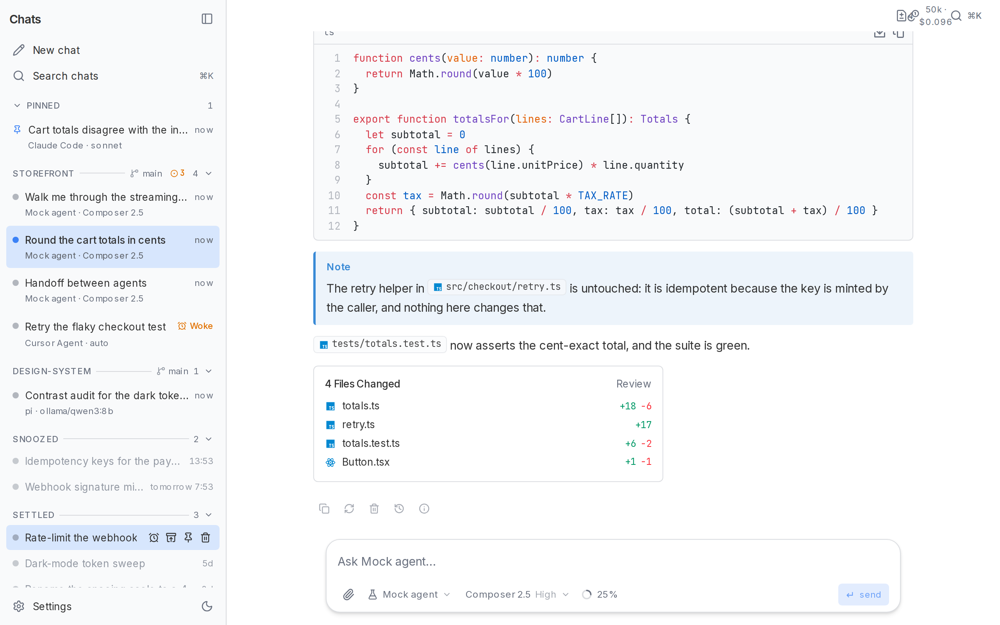
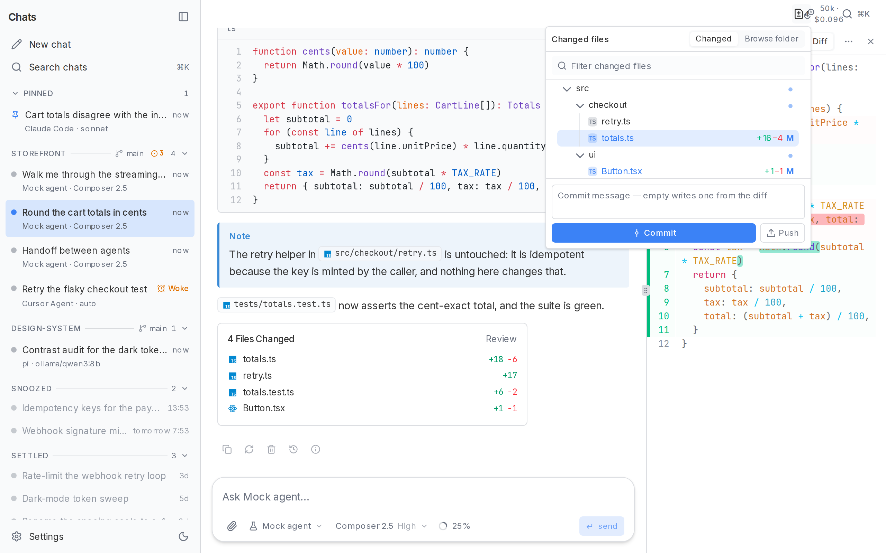

# Agent UI

A local-first desktop and web client for AI coding agents. Agent UI gives
Cursor Agent, Claude Code, Codex, pi, Ollama, OpenAI-compatible models, and
[Agent Client Protocol](https://agentclientprotocol.com/) servers one
conversation interface built with Next.js, React, TypeScript, and Tauri.

[](https://github.com/miskibin/agent-ui/actions/workflows/ci.yml)
[](https://github.com/miskibin/agent-ui/actions/workflows/desktop.yml)

[Download for Windows](https://github.com/miskibin/agent-ui/releases/latest) ·
[Chat Components](https://github.com/miskibin/chat-components)


## Why Agent UI

- **One UI, multiple agents.** Switch providers inside a chat. Each backend
  keeps its own resumable session, and an explicit handoff summarizes what it
  missed.
- **Background runs.** A turn keeps streaming when you open another chat.
  Returning shows the same in-flight run and transcript.
- **Agent-native output.** Reasoning, tool lifecycles, structured questions,
  markdown, code, diagrams, artifacts, token usage, and failures are
  first-class parts of the conversation. A plan the agent writes is rendered as
  a card with a Build button that starts the work. Unanswered questions stay above the
  composer while you scroll; submitting or skipping restores their summary in
  the transcript.
- **Workspace-aware files.** Give each chat a folder, inspect changed files and
  diffs beside the transcript, then open them in your editor or terminal. The
  header opens a tree of everything the chat changed, and a lazy browser for the
  rest of the folder; binary files say so instead of pretending to be text.
- **A worktree per chat.** Start a chat in a git worktree of its own — its own
  branch, in the app's own directory — so two agents work on one repository
  without touching one file. Branches are named after the chat, and removing the
  last chat that used one offers to remove the worktree with it.
- **Commit, push, and see what is serving.** Stage what the chat changed and
  commit it with a message written from the diff in the repository's own style,
  push the branch (upstream set on the first push), and open the dev servers the
  work left running on localhost.
- **Per-turn checkpoints.** Every turn in a git folder is bracketed by a
  worktree snapshot, so one action puts the files back the way they were before
  it ran. Switchable in Settings → Chat.
- **Composer that remembers.** ArrowUp walks back through the prompts already
  sent in the chat, drafts survive a chat switch, and answers render GitHub
  alerts and clickable `path.ts:42` chips.
- **Skills and harness commands.** `$name` offers the skills installed on this
  machine and sends each harness the invocation it actually understands; `/`
  lists the CLI's own commands beside the app's. The context meter offers
  "Compact context" where the harness has it, and suggests compacting before you
  resume a long conversation you left hours ago.
- **Search what was said.** ⌘K matches chats by title *and* by the words in
  their messages, then opens the chat at the matching turn.
- **Import your CLI history.** Bring the conversations Claude Code and Codex
  have already had into the app, preserving their original resumable sessions.
- **Hold to quit.** ⌘Q while a turn is running is held, not confirmed: nothing
  is in the way when nothing is running, and a stray press cannot kill an agent
  mid-edit.
- **A sidebar you can size.** Drag its edge (or resize it from the keyboard),
  group chats by working folder, pin and delete from the row itself.
- **Local persistence.** Chats, settings, provider sessions, and optional memory
  live under `~/.agent-ui`.
- **Visible usage.** See tokens and estimated cost per chat, model, and working
  folder over 7 days, 30 days, or all time — cache reads and writes counted at
  their own rates, and unpriced turns reported rather than folded in.
- **Desktop or browser.** The same Next.js application runs in a frameless
  Tauri shell or as a standalone local server.

## Backends

| Backend | Connection | Tools | Resume |
| --- | --- | :-: | :-: |
| Cursor Agent | local `agent` CLI | Yes | Yes |
| Claude Code | local `claude` CLI | Yes | Yes |
| Codex | local `codex app-server` over stdio | Yes | Yes |
| pi | local `pi` CLI with Ollama or hosted models | Yes | Yes |
| ACP agents | configured command over JSON-RPC; includes a DeepSeek Harness profile | Yes | Yes |
| Ollama | native streaming chat API | No | Transcript replay |
| Chat | any configured OpenAI-compatible `/chat/completions` endpoint | No | Transcript replay |
| Mock | local scripted backend for development and tests | Yes | No |

Provider availability is detected at runtime. Configure binaries, endpoints,
API keys, models, workspaces, and supported permission modes in Settings.

### Codex

Install the Codex CLI and sign in with `codex login`, then choose Codex in
Settings → Harnesses. Agent UI uses the CLI’s existing account and discovers
its available models at runtime and supports reasoning effort selection. Set a binary path if
`codex` is not on PATH. The default permission mode allows edits in the chat’s
workspace; read-only and full-access modes are also available.

See the [official app-server documentation](https://learn.chatgpt.com/docs/app-server)
for the protocol used by this integration.

## Quick start

Requires Node.js 20.9 or newer.

```bash
git clone https://github.com/miskibin/agent-ui.git
cd agent-ui
npm install
npm run dev
```

Open [http://localhost:3000](http://localhost:3000). The mock backend works
without another model or CLI, so the complete interface is available
immediately.

For the native app, install the
[Tauri prerequisites](https://v2.tauri.app/start/prerequisites/), then run:

```bash
npm run desktop:dev
npm run desktop:build
```

`desktop:build` creates an installer for the current platform. Signed Windows
installers and update metadata are published on
[GitHub Releases](https://github.com/miskibin/agent-ui/releases).

### Download size

The installer carries a Node.js runtime and the Next standalone server, so it
is measured in hundreds of megabytes rather than tens — that is the price of an
app that runs its own server on `127.0.0.1` with nothing to install first. Two
things keep it from being larger than it needs to be, and both are easy to undo
by accident:

- **Only NSIS is bundled on Windows.** `bundle.targets` in
  `src-tauri/tauri.conf.json` lists every target except `msi`; WiX packed the
  same payload into an installer roughly twice the size of the NSIS one
  (v0.6.0: 478 MB against 235 MB), and the updater feeds off NSIS anyway. Going
  back to `"all"` republishes that second, larger download.
- **sharp is excluded from the server trace.** Next traces `sharp` and its
  libvips prebuilds — about 46 MB, more than half the standalone bundle — into
  every server build, whether or not the image optimizer can be reached. This
  app renders every image through a plain ``, so `images.unoptimized` turns
  the `/_next/image` route off and `outputFileTracingExcludes` in
  `next.config.ts` drops the package. The two belong together: excluding sharp
  while leaving the optimizer routable would fail at runtime instead of at
  build time.

Together they take the staged payload from 108 MB to 59 MB. `du -sh
.next/standalone .next/static` after a build is the number to watch.

## Screenshots

| Sidebar shelves | Everything the chat changed |
| --- | --- |
|  |  |

| File review | Agent handoff |
| --- | --- |
|  |  |

| Command palette | Usage by model and folder |
| --- | --- |
|  |  |

## Data and permissions

The app stores plain local files in `~/.agent-ui`. Set `AGENT_UI_DIR` to use
another location.

- `settings.json` — appearance, providers, API keys, and chat behavior
- `sessions/index.json` — sidebar and session metadata
- `sessions/<id>.json` — rendered transcripts
- `memory/*.md` — optional cross-chat memory; off by default
- `imports.json` — which chats were imported, and from which CLI
- `worktrees/` — git worktrees the app created for chats that asked for one
- `pi/` and `dsh/` — isolated harness configuration and session data

Treat that directory as sensitive. Agent backends can read files, edit files,
and run commands according to their own capabilities and the permission mode
you select. In particular, pi currently has no sandbox and runs with your OS
user permissions.

## Architecture

```text
React UI ── SSE ──► POST /api/chat ──► AgentProvider.run()
                         │                 ├─ local CLI
                    JSON store             ├─ HTTP model API
                         │                 └─ ACP process
                         ▼
                    ~/.agent-ui
```

Every backend maps to one `AgentStreamEvent` protocol:
`session | status | thinking | tool | text | done | error`. The UI is sourced
from [chat-components](https://github.com/miskibin/chat-components), a
shadcn/ui registry whose files are vendored into this repository.

## Repository map

- `app/` — Next.js pages and API routes
- `app/hooks/use-turn-runner.ts` — concurrent in-flight turns
- `lib/providers/` — backend adapters and provider registry
- `lib/store/` — local session persistence
- `lib/usage.ts` — token and estimated-cost aggregation
- `components/ui/` — vendored chat-components source
- `src-tauri/` — native desktop shell
- `tests/` — provider, persistence, streaming, and UI behavior tests

If you are an AI coding agent, read `AGENTS.md` first. Change shared UI
primitives in chat-components, regenerate its registry, then sync the vendored
files here byte-for-byte.

## Development

```bash
npm run lint
npm run typecheck
npm run test
npm run vendor:check
npm run build
```

## License

MIT
