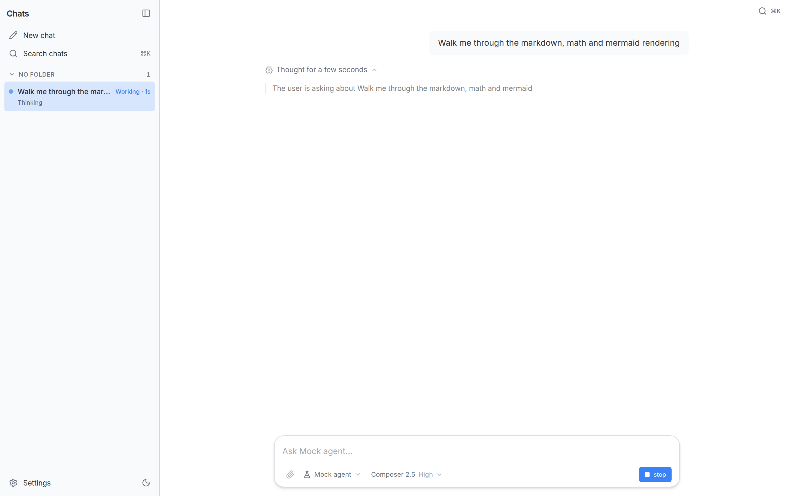
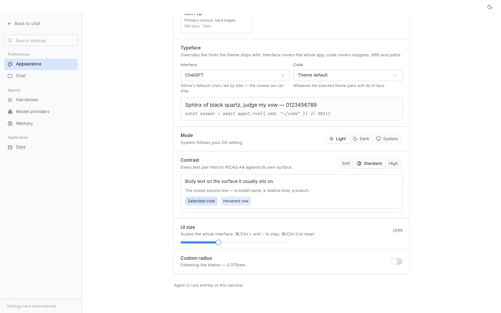
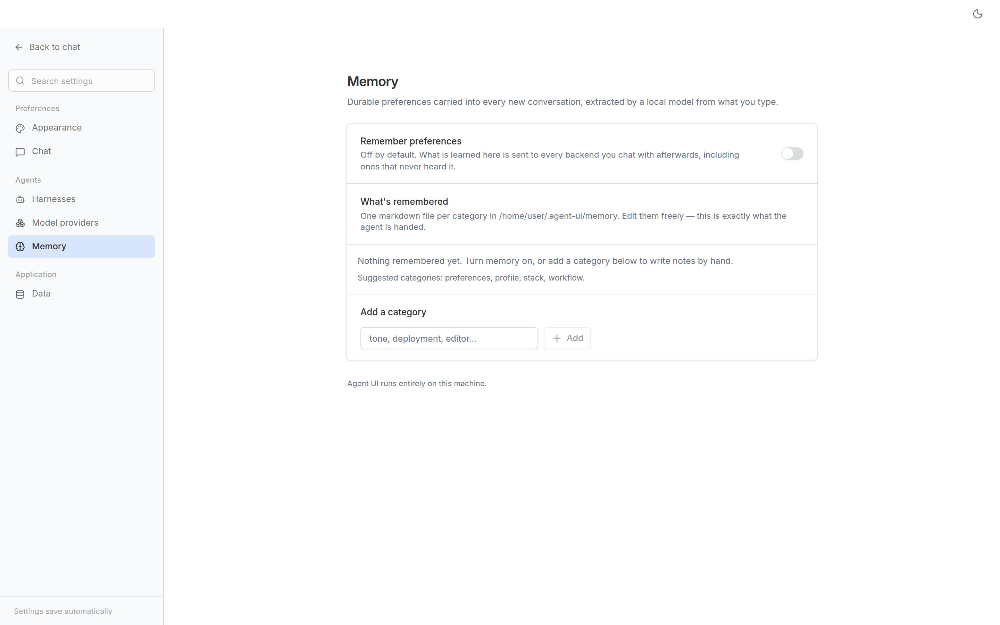
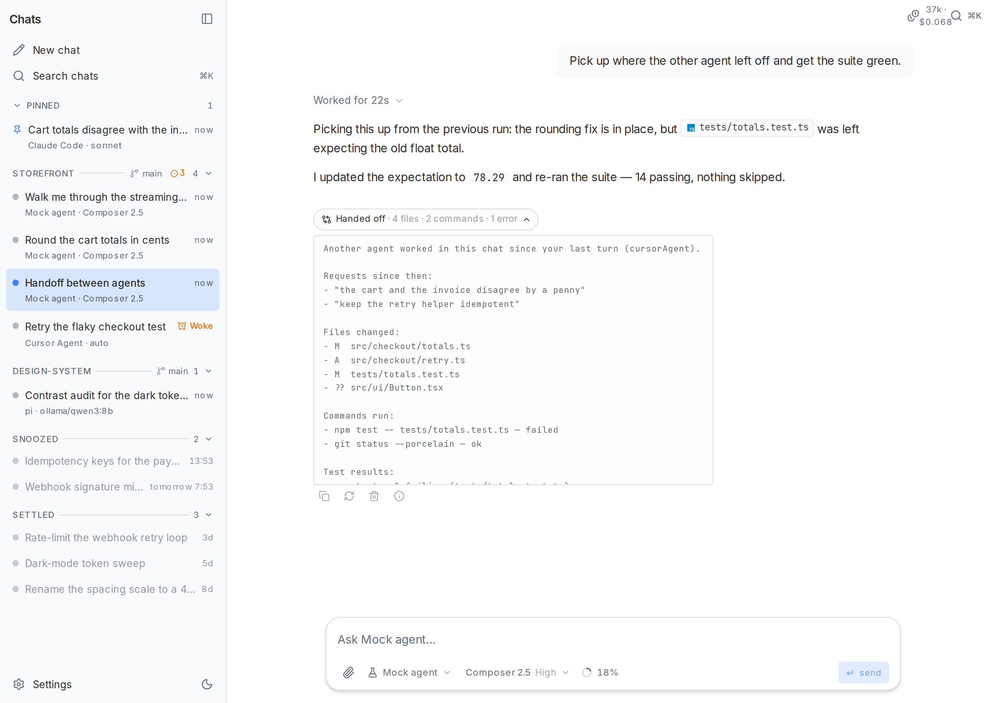
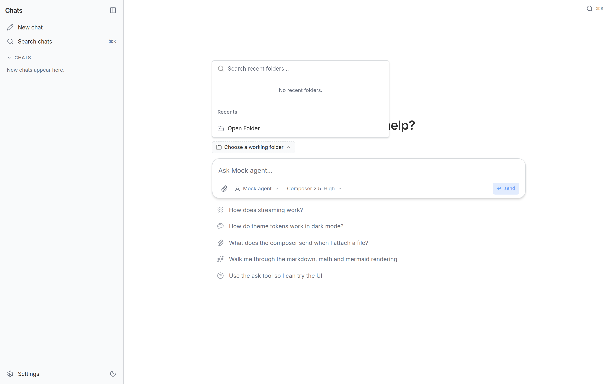

# Agent UI

A fast, local-first **desktop app** for coding agents. One interface, swappable backends: the local `cursor-agent` CLI, any model served by [Ollama](https://ollama.com) — as plain chat or as a full agentic run through the [`pi`](https://pi.dev) harness — anything that speaks the [Agent Client Protocol](https://agentclientprotocol.com), or a scripted mock — with Claude Code and OpenCode adapters on the roadmap. Built entirely on [miskibin/chat-components](https://github.com/miskibin/chat-components), the shadcn/ui registry of agent-grade chat primitives, wrapped in a frameless Tauri shell with its own window chrome.

[](https://github.com/miskibin/agent-ui/actions/workflows/ci.yml) [](https://github.com/miskibin/agent-ui/actions/workflows/desktop.yml)


Reasoning streams, tool calls with live status (including failures), Shiki code, tables, KaTeX and Mermaid, a files-changed summary with per-file diff stats — every turn is rendered from the shared `AgentStreamEvent` protocol, whatever backend produced it. While a turn runs you watch it work; once it settles, the reasoning and tool calls fold into a single "Worked for 12s" row above the answer, one click from being opened again, with copy / regenerate / delete and a details popover — model, duration, tokens in and out, tok/s, folder — next to it.

Every file the agent touches is one click from the transcript. An edit headline, a row in the files-changed card or a `path.ts` chip in the answer's own text opens a **side-by-side file panel** — the diff, or the whole file with the edited lines marked, syntax-highlighted and scrolled to the first change. Material-style file icons mark the file everywhere it is named. On a wide window the panel is one half of a **draggable split** below the header — the width you drag it to is remembered — and below `md` it slides over the conversation instead. The panel reads the file through `GET /api/file`, which is confined to the active provider's workspace (and never the app's own data directory), and falls back to the diff alone when there is nothing to read.

A harness that keeps a todo list gets **one line above the composer**: the task it is on, how many of them are done, and the whole checklist one click away. It is derived from the newest todo tool call in the thread — `todo_write` and its spellings, or an ACP `plan` update folded into the same shape — so it survives a reload and an old turn still shows the plan it ended on instead of a page of raw JSON.

### The wait says what it is

The stretch before a local model's first token is the one that looks broken, and "Thinking" is the wrong word for it: nothing is thinking yet, the weights are still being read off disk. Backends can send a `status` line, and the app shows it where the turn it belongs to is — above the empty answer, and on that chat's sidebar row — counting up, so a long wait reads as a long wait rather than a hang. Ollama asks `/api/ps` before every run, so it knows whether the model is cold and says so by name.



| Dark mode (Cosmic Night theme) | ⌘K command palette |
| --- | --- |
|  |  |


### Sixteen themes, and a contrast you choose

Every theme is a complete shadcn item from the [tweakcn](https://tweakcn.com) registry — colours, radius, shadows, tracking and typefaces, tuned separately for light and dark — applied by swapping one attribute on `<html>`, so switching is instant and costs no request.

Two things are the app's, not the registry's. The **accent** — the colour behind every hover and every selected chat — is derived: a tint of that theme's own primary over its own surface, weakened until the surface's ink still reads on it. It keeps the theme's hue while making the hover the same shape in all sixteen, and it is what stops a theme whose accent happens to sit next to its foreground from painting white on white. And **contrast is a setting**: *Standard* holds every text pair to WCAG AA against the surface it actually sits on, *High* to AAA, *Soft* relaxes the greys down to a readable floor. Each level is computed per theme, per mode, and only moves lightness — never the hue you picked.





## Providers

| Provider | Tools | Resume | How it connects |
| --- | :-: | :-: | --- |
| **Cursor Agent** | ✅ | ✅ | Spawns the local `agent` CLI; full agentic runs in your workspace |
| **Ollama** | — | replayed | Direct `/api/chat` streaming with `thinking` support (deepseek-r1, qwen3…); stateless, so the app replays the stored transcript |
| **pi** | ✅ | ✅ | Spawns the [`pi`](https://pi.dev) CLI in `--mode json` — read/write/edit/bash over your local *and* hosted models, sessions on disk |
| **DeepSeek Harness** | ✅ | ✅ | Spawns `dsh --profile acp` and speaks [ACP](https://agentclientprotocol.com) over stdio — 25 tools, DeepSeek's own models or any OpenAI-compatible endpoint |
| *any ACP agent* | ✅ | ✅ | Add a command in settings; no code change needed |
| **Chat (direct)** | — | replayed | Tool-less streaming chat against any configured model provider's `/chat/completions` — no CLI, no sandbox |
| **Mock** | ✅ | — | Scripted runs that exercise every UI part; no binary, no network |

Providers are detected at runtime and surfaced in the picker with availability badges. On Windows, a missing harness binary (pi, Cursor Agent, DeepSeek Harness, or any ACP agent) offers **Configure** in that row — a native file dialog that writes the picked path into settings. The `AgentProvider` interface (`lib/providers/types.ts`) is ~30 lines — a new backend is one file plus a registry entry.

Picking a model is three choices, not one: a harness (Cursor, pi, Chat, dsh, …), then a **model provider** — Ollama, or one of the OpenAI-compatible sources configured in **Settings → Model providers** — then a model from that provider's catalog. Ten presets ship built in (OpenAI, Anthropic, xAI, Google, DeepSeek, Groq, Mistral, OpenRouter, Together AI, Fireworks); add your own with a name, base URL and optional API key, and **Test** checks it against the provider's `/models` before you rely on it. A model's id everywhere in the app is `<provider>/<model>` — `openai/gpt-4o`, `ollama/qwen3:8b` — so the picker can group every source under its own heading instead of one flat list, with a brand mark next to each.

Every harness that isn't tied to one model source draws from this same list: `pi` unions it with Ollama's own catalog when it writes `models.json`, and **Chat (direct)** streams straight against whichever source the model id names. Neither half is required — `pi` is just as usable with only a DeepSeek key and no local server as with only Ollama and no keys.

**Reasoning effort** rides along in the same picker, one submenu below the model, for every harness whose backend can carry it: Ollama gets a graded `think` level where the model has one, hosted providers get `reasoning_effort`, and ACP agents get the matching session config option. The one exception is Cursor Agent, whose CLI picks reasoning depth per model and takes no flag — that row simply has no effort line.

Permission is one concept across every harness that supports it: **read-only**, **edits**, or **full access**. A provider that can enforce a mode advertises which ones, and only then does the composer show a per-chat picker next to the model — ACP's generic client offers read-only/full, the DeepSeek Harness maps all three onto its own sandbox setting. The choice is remembered per session.

### Switching agents mid-chat

A chat is one conversation; each backend in it is a different one. Every provider keeps **its own
backend session per chat**, so moving from Cursor Agent to pi and back resumes each side where it
left off instead of throwing one away — the composer's provider list says which agents will
resume, when each last ran, and which one is owed a handoff. A stored session is only reused in
the folder it was started in (a different checkout is a different working context); changing the
*model* keeps it.

The agent coming back is then told what it missed. Each chat keeps a small journal of what
actually happened — requests, tool calls with their paths and commands, how each turn ended — and
the events an agent has not seen are folded into one deterministic block in front of its next
prompt: the last few requests, the files that changed (a `git diff --stat` against the commit it
last saw, and the dirty files around it), the commands that ran with their exit codes, which of
them were test runs, and any errors or unfinished work. If the working tree moved under it, the
block says so in one sentence that no truncation can drop: *re-read affected files before
editing.*

Nothing about it is implicit. The block is shown as a collapsible **Handed off** marker under the
turn it was sent with, and opening it shows the exact text the agent received.



It is capped at 8000 characters and sheds the oldest detail first. The worktree read behind it is deliberately
cheap and strictly read-only — one `rev-parse`, one `git status --porcelain --no-optional-locks`,
1.5 seconds each — so it can never disturb what you have staged, and a missing git, a timeout or
a folder that is not a repository simply leaves that part unsaid.

This is not memory, and the two never mix: memory is durable, spans chats and is about *you*; a
handoff is thrown away with the chat and is about the *other agents in it*. Nothing a handoff says
is ever written to your memory files, and the memory extractor never sees it. On by default,
under **Settings → Chat**.

### One folder per chat

The picker sits directly above the composer on a new chat, where choosing where the agent works is the next thing to do. Once the conversation starts it steps out of the way, and the folder becomes how the sidebar is organised: the chats of one checkout are one section, headed by the folder and the branch, with the pinned chats above them and the folderless ones last. Providers that spawn a CLI (Cursor, pi) run in it, so two chats can work in two checkouts at once. Nothing is checked out for you — the branch is what you record, not what the app switches to.



Four ways in, because each covers a case the others do not:

- **Recents**, first — the answer is usually a folder you already used. Each one can be forgotten again; an MRU nobody can prune stops being useful.
- **A browser**, rooted at your home directory or at `/`, marking git repos as it goes. It runs off the app's own route rather than an OS dialog, so it works identically in a browser tab and in the desktop shell.
- **A typed path**, with `~` and completion as you type: `~/code/ag` lists `~/code` and narrows to what matches.
- **The system chooser**, in the desktop shell, for when the folder is easier to find in Explorer or Finder. Feature-detected — a browser tab simply does not show the button.

The path is validated on the server while you type, and the repo's local branches are offered when it is a git repo.

### The pi harness

Ollama on its own answers questions; `pi` turns the same models — or any model provider you configured — into an agent that reads and edits files and runs commands. It is the smallest harness that does this well — four tools, ~7k tokens of cold-start context, so a 4–8B model still has room to think:

```bash
npm install -g --ignore-scripts @earendil-works/pi-coding-agent   # provides `pi`
ollama pull qwen3:8b                                             # or qwen2.5-coder:7b
```

Then pick **pi** in the composer. The app writes a `models.json` with one entry per model source — your Ollama server, every enabled model provider, or just one of the two — so no manual `~/.pi` setup is needed, and `PI_CODING_AGENT_DIR` keeps it separate from a personal pi install.

Two things worth knowing:

- **pi has no sandbox.** It edits files and runs shell commands in its workspace with your permissions and no approval prompt. Set **Harnesses → pi → workspace** to the directory you want it loose in; it defaults to the app's own cwd.
- **Set `num_ctx` explicitly.** Ollama's default context silently truncates an agent prompt after a few tool calls; give the model a Modelfile with as much context as your VRAM allows.
- **On Windows**, `npm i -g` installs pi as a `pi.cmd` shim, and Node refuses to spawn `.cmd` files directly. The app looks past the shim for pi's own entry point automatically; if your install is laid out unusually, point **Harnesses → pi** at a `pi.exe` or at the `…\dist\bundle\cli.js` the shim wraps — a `.js` path is run with the app's own Node.

### ACP agents and the DeepSeek Harness

The [Agent Client Protocol](https://agentclientprotocol.com) is JSON-RPC 2.0 over newline-delimited stdio: the app spawns an agent, and the two sides call each other — the agent streams the turn, and the app serves `fs/read_text_file`, `fs/write_text_file` and `session/request_permission` back. Anything that speaks ACP v1 is a provider here, configured rather than coded: **Settings → Harnesses → Add an ACP agent** takes a command, arguments, a workspace and a permission policy, and the agent shows up in the picker as `acp:<name>`.

[DeepSeek Harness](https://www.npmjs.com/package/@deepseek-ai/dsh) (`dsh`) ships pre-configured as the first one. ACP lives only on its `alpha` tag — `latest` has no ACP bundle at all — and a plain install of it is pathological, so pin the version and skip the scripts:

```bash
npm install -g --no-audit --no-fund --ignore-scripts @deepseek-ai/dsh@0.1.2-alpha.3
```

Then pick **DeepSeek Harness** in the composer and either paste a DeepSeek API key into settings (or export `DEEPSEEK_API_KEY`), or point it at an OpenAI-compatible base URL — your Ollama server, say — in which case the app generates a `--patch` overlay declaring that route, the same way it generates pi's `models.json`. `DSH_HOME` is pointed at `~/.agent-ui/dsh` so nothing lands in a personal `~/.dsh`, and telemetry, which dsh enables by default, is switched off.

Three things worth knowing:

- **Answers are not streamed token by token.** dsh puts committed messages on the wire, so a whole reply lands at once at the end of the turn. Progress during a long run shows up as tool calls, which *do* arrive incrementally.
- **Permission requests are answered by a policy, not a prompt.** dsh asks for approval when the model tries to escalate past its sandbox; the per-agent setting is *approve everything* (the default), *approve reads only*, or *reject everything*. There is no mid-run dialog — the agent's turn is blocked until the answer goes back, and the browser has no way to reply into an open stream.
- **`dsh` loads a `.env` from its workspace directory**, and its own sandbox mode (read-only / workspace-write / full access) is a separate setting from the permission policy above.

## Quick start

```bash
npm install
npm run dev        # http://localhost:3000 in the browser
```

### Desktop app

The Tauri shell is frameless — the header you see **is** the window chrome: drag region, double-click to maximize, min/max/close controls (native traffic lights on macOS), the ⌘K palette, settings and theme toggle.

```bash
npm run desktop:dev                            # first run fetches the Node sidecar
npm run desktop:build                          # installer for your platform
```

A production bundle ships the Next standalone server as a Node sidecar: the shell picks a free port, boots the server (~0.6 s), and only then shows the window — no white flash, dark splash if startup is slow. Releases build a Windows (x64) installer via GitHub Actions — push a `v*` tag, or run the Release workflow from the Actions tab with the tag to cut. `npm run desktop:build` still produces an installer for whichever platform you are on.

### Updater

The desktop app updates itself. A few seconds after startup — off the critical path, in an idle callback — it asks the [`latest.json`](https://github.com/miskibin/agent-ui/releases/latest/download/latest.json) published with the newest release whether there is anything newer, and if so shows one toast: **Update** downloads and verifies the signed bundle, then offers **Restart**. **Later** dismisses it, and ⌘K → *Check for updates* asks again on demand. Offline, the check fails silently; in a browser tab there is no updater at all (`lib/desktop.ts` no-ops without the Tauri global).

Updates are signed, so releases only work once the repository owner has created a key **once**:

```bash
npx tauri signer generate -w ~/.tauri/agent-ui.key
```

That prints a public key and writes the private key next to it. Then:

1. Paste the **public** key into `src-tauri/tauri.conf.json` → `plugins.updater.pubkey`, replacing the `REPLACE_WITH_TAURI_UPDATER_PUBLIC_KEY` placeholder, and commit it — the public key is meant to ship.
2. Add two **GitHub Actions secrets** (Settings → Secrets and variables → Actions):
   - `TAURI_SIGNING_PRIVATE_KEY` — the contents of `~/.tauri/agent-ui.key`
   - `TAURI_SIGNING_PRIVATE_KEY_PASSWORD` — the password you chose (empty string if none)
3. Keep the private key and its password out of the repo. Losing them means shipping a new public key, which older installs will refuse — they will need a manual reinstall.

Until the real public key replaces the placeholder, an update that an installed build downloads fails signature validation — the check itself still runs and reports the failure as a toast, and nothing crashes.

`bundle.createUpdaterArtifacts` is on, so **any** bundling run (CI or `npm run desktop:build`) needs the private key in the environment; without `TAURI_SIGNING_PRIVATE_KEY` the bundler stops at the updater artifact rather than shipping something no one can verify:

```bash
export TAURI_SIGNING_PRIVATE_KEY="$(cat ~/.tauri/agent-ui.key)"
export TAURI_SIGNING_PRIVATE_KEY_PASSWORD="…"
npm run desktop:build
```

`npm run desktop:dev` needs none of this.

### Web / server

Production without the shell is the same self-contained standalone server — fast cold start, no `node_modules` on the target machine:

```bash
npm run build
node .next/standalone/server.js
```

## Where your data lives

Everything is local JSON under `~/.agent-ui` (override with `AGENT_UI_DIR`):

- `settings.json` — appearance, providers, chat behavior
- `sessions/index.json` — sidebar metadata (titles, pins, order, provider/model, working folder, timestamps)
- `sessions/<id>.json` — full transcripts (reasoning, tool calls, markdown)
- `memory/<category>.md` — one markdown file per memory category, only if you turn memory on

- `pi/models.json` — generated: one entry per model source, your Ollama server's OpenAI-compatible endpoint and every enabled model provider
- `pi/sessions/*.jsonl` — pi's own transcripts, kept out of your personal `~/.pi/agent`
- `dsh/patch.json` — generated: the `--patch` overlay declaring your OpenAI-compatible endpoint as a dsh model route
- `dsh/sessions/**` — dsh's own session logs, kept out of your personal `~/.dsh`

The agent backends keep their own conversation context (Cursor, pi and ACP sessions resume by id); this store owns what they don't — your rendered transcripts and sidebar state.

## Settings

`/settings` applies everything instantly and persists to `settings.json`:

- **Appearance** — nine complete shadcn themes vendored from the [tweakcn](https://tweakcn.com) registry (Modern Minimal, Graphite, T3 Chat, Catppuccin, Mocha Mousse, Cosmic Night, Amethyst Haze, Perpetuity, Notebook). A theme is not just a palette: it brings its own typeface, corner radius, shadows and letter-spacing, in separate light and dark sets, and the app's own surfaces (code blocks, tool cards, message bubbles) are mixed from those tokens so a warm theme warms the whole window. Plus light/dark/system mode, UI size (⌘/Ctrl + and −, persisted), and an optional radius override.

  **Typeface** is the one token you can pin across every theme: an interface font and a code font, each defaulting to a stack led by the face ChatGPT renders with, each option drawn in its own face in the list. The override is written straight onto `<html>`, which outranks the theme's own value; picking *Theme default* hands the decision back. A tiny inline bootstrap script applies the stored theme *and* the stored fonts before first paint — no flash, no reflow.

  Adding a theme is one entry in `scripts/import-tweakcn.mjs` and `node scripts/import-tweakcn.mjs`, which refreshes the checked-in `lib/theme/themes/generated.ts`; if it names a typeface the app does not load yet, the script says so.
- **Harnesses** — enable/disable each backend, Ollama base URL, `cursor-agent` and `pi` binary paths, the pi workspace directory, the list of ACP agents (command, workspace, permission policy, plus dsh's endpoint and sandbox), default provider, with live reachability badges.
- **Model providers** — the ten built-in presets plus any custom OpenAI-compatible endpoint: enable one, paste in an API key if it needs one, add manual model ids for an endpoint whose `/models` is missing or gated, and **Test** it before trusting it. Every enabled source shows up as a group in the model picker everywhere in the app.
- **Memory** — off by default. A small local model reads *your* messages after each turn and keeps a handful of durable preferences — how you want answers written, your stack, how you work — in `~/.agent-ui/memory/<category>.md`. Those facts are handed to every backend you chat with afterwards, so it is opt-in and everything about it is visible: the files are plain markdown you can read and edit right in settings (rename a category to move its facts), a toast says when an update is running, and a marker in the thread says what changed.

  The whole store is capped (2000 characters by default), which is the design: at that size every fact fits in the prompt, so there is no retrieval step, no embeddings and no vector store — and going over the cap makes the extractor merge and shorten what it already has instead of piling on more. It rewrites whole categories rather than appending lines, so contradictions get replaced rather than accumulated.

  The extractor only ever sees what you typed — never the agent's replies, its tool calls, or any file it read — so nothing in a repository you point the agent at can write itself into a file that goes into all your later conversations. Health, ethnicity, religion, politics and gender identity are skipped unless you opt in; identity numbers, payment details and credentials are never stored either way. Needs Ollama; without it the notes are still used, just never updated automatically.
- **Chat** — default reasoning effort, prompt suggestions, auto-titling, notification sounds for completed runs and questions that need attention, and the **agent handoff** switch below.

- **Data** — data directory, a clear-all-chats action, and **Local files**: whether an answer may show an image by absolute path from anywhere on the machine (on by default) or only from the app's folder, a chat's working folder and the agent workspace.

## Architecture

```
app/page.tsx ── SSE ──► POST /api/chat ──► AgentProvider.run()
                              │                 ├── mock      (scripted)
                 persists     ▼                 ├── cursor    (spawns CLI)
                        lib/store/*.json        ├── ollama    (HTTP stream)
                                                ├── pi        (spawns CLI → Ollama + model providers)
                                                ├── chat      (HTTP stream → a model provider)
                                                └── acp:*     (spawns an ACP agent, JSON-RPC both ways)
```

- One streaming protocol (`AgentStreamEvent`: `session · status · thinking · tool · text · done · error`) between every backend and the UI. `status` carries progress that is not part of the answer; `done` carries the turn's token usage.
- The chat surface is a pure client page: nothing on the critical path waits for the server, the sidebar seeds from a localStorage snapshot before the network answers, and message rows keep the memoization guarantees of the component family during streaming.
- UI comes from the chat-components registry — themed by shadcn tokens, customizable through `data-slot` attributes without forking.
- `GET /api/file` backs the file panel: it resolves a path against the chat's own folder when it has one, else the running provider's workspace (`cursor-agent` and the mock use the app's cwd, pi its configured workspace), refuses anything outside that root or inside the app's data directory, and caps a read at 1.5 MB.

## Development

```bash
npm run lint        # eslint
npm run typecheck   # tsc --noEmit
npm run test        # node --test over tests/*.test.ts — no test runner to install:
                    #   Node strips the types, tests/register.mjs resolves `@/`
npm run build       # next build (standalone output)
```

## License

MIT
